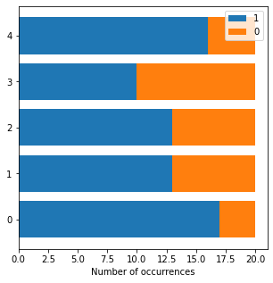
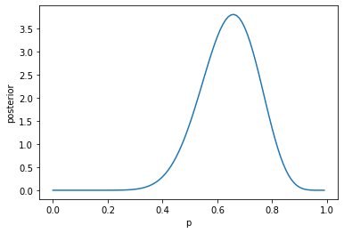

<!--
Document Author
Yuta Nakahara <yuta.nakahara@aoni.waseda.jp>
Shota Saito <shota.s@gunma-u.ac.jp>
-->


## Purpose

BayesML is a library designed for promoting research, education, and application of machine learning based on Bayesian statistics and Bayesian decision theory. Through these activities, BayesML aims to contribute to society.

## Characteristics

BayesML has the following characteristics.

* The structure of the library reflects the philosophy of Bayesian statistics and Bayesian decision theory: updating the posterior distribution learned from the data and outputting the optimal estimate based on the Bayes criterion.
* Many of our learning algorithms are much faster than general-purpose Bayesian learning algorithms such as MCMC methods because they effectively use the conjugate property of a probabilistic data generative model and a prior distribution. Moreover, they are suitable for online learning.
* All packages have methods to visualize the probabilistic data generative model, generated data from that model, and the posterior distribution learned from the data in 2~3 dimensional space. Thus, you can effectively understand the characteristics of probabilistic data generative models and algorithms through the generation of synthetic data and learning from them.

For more details, see our [website](https://yuta-nakahara.github.io/BayesML/ "BayesML's Documentation").

## Installation

Please use the following commands to install BayesML.

``` bash
pip install bayesml
```

The following are required.

* Python (>= 3.7)
* NumPy (>= 1.20)
* SciPy (>= 1.7)
* MatplotLib (>= 3.5)
* Scikit-learn (>= 1.1)

## Example

We show an example of generating data drawn according to the Bernoulli distribution and learning from them.

First, we create an instance of a probabilistic data generative model. Here, the parameter `theta`, which represents an occurrence probability of 1, is set to 0.7.

``` python
from bayesml import bernoulli

gen_model = bernoulli.GenModel(theta=0.7)
```

You can visualize the characteristics of the created model by the following method.

``` python
gen_model.visualize_model()
```

>theta:0.7  
>x0:[1 1 1 0 1 1 1 0 1 1 1 1 1 1 0 1 1 1 0 1]  
>x1:[1 1 0 1 1 1 1 1 1 1 1 1 0 1 1 1 1 1 1 0]  
>x2:[1 0 1 1 0 1 1 1 0 1 1 1 1 1 0 0 1 1 1 1]  
>x3:[1 1 1 0 1 1 0 1 0 0 0 0 1 0 1 1 1 1 1 1]  
>x4:[0 0 1 0 0 0 1 1 1 1 1 1 1 1 0 0 1 1 1 1]  
>

After confirming that the frequency of occurrence of 1 is around `theta=0.7`, we generate a sample and store it to variable `x`.

``` python
x = gen_model.gen_sample(sample_size=20)
```

Next, we create an instance of a model for learning posterior distribution.

``` python
learn_model = bernoulli.LearnModel()
```

A method to visualize the posterior distribution also exists (the prior distribution is shown here because learning from data has not been performed yet).

``` python
learn_model.visualize_posterior()
```

>

After learning from the data, we can see that the density of the posterior distribution is concentrated around the true parameter `theta=0.7`.

``` python
learn_model.update_posterior(x)
learn_model.visualize_posterior()
```

>

In Bayesian decision theory, the optimal estimator under the Bayes criterion is derived as follows. First, we set a loss function, e.g., a squared-error loss, absolute-error loss, and 0-1 loss. Then, the Bayes risk function is defined by taking the expectation of the loss function with respect to the distribution of data and parameters. By minimizing the Bayes risk function, we obtain the optimal estimator under the Bayes criterion. For example, if we set a squared-error loss, the optimal estimator under the Bayes criterion of the parameter `theta` is the mean of the posterior distribution.

In BayesML, the above calclulation is performed by the following methods.

``` python
print(learn_model.estimate_params(loss='squared'))
print(learn_model.estimate_params(loss='abs'))
print(learn_model.estimate_params(loss='0-1'))
```

>0.7380952380952381  
>0.7457656349087012  
>0.7631578947368421  

Different settings of a loss function yield different optimal estimates.

## Package list

The following packages are currently available. In this library, a probabilistic data generative model, prior distribution, posterior distribution (or approximate posterior distribution), and predictive distribution (or approximate predictive distribution) are collectively called a model.

* [Bernoulli model](https://yuta-nakahara.github.io/BayesML/bayesml.bernoulli.html "Bayesml Bernoulli Model")
* [Categorical model](https://yuta-nakahara.github.io/BayesML/bayesml.categorical.html "BayesML Categorical Model")
* [Poisson model](https://yuta-nakahara.github.io/BayesML/bayesml.poisson.html "BayesML Poisson Model")
* [Normal model](https://yuta-nakahara.github.io/BayesML/bayesml.normal.html "BayesML Normal Model")
* [Multivariate normal model](https://yuta-nakahara.github.io/BayesML/bayesml.multivariate_normal.html "BayesML Multivariate Normal Model")
* [Exponential model](https://yuta-nakahara.github.io/BayesML/bayesml.exponential.html "BayesML Exponential Model")
* [Gaussian mixture model](https://yuta-nakahara.github.io/BayesML/bayesml.gaussianmixture.html "BayesML Gaussian Mixture Model")
* [Linear regression model](https://yuta-nakahara.github.io/BayesML/bayesml.linearregression.html "BayesML Lenear Regression Model")
* [Meta-tree model](https://yuta-nakahara.github.io/BayesML/bayesml.metatree.html "BayesML Meta-tree Model")
* [Autoregressive model](https://yuta-nakahara.github.io/BayesML/bayesml.autoregressive.html "BayesML Autoregressive Model")
* [Hidden Markov normal model](https://yuta-nakahara.github.io/BayesML/bayesml.hiddenmarkovnormal.html "BayesML Hidden Markov Normal Model")
* [Context tree model](https://yuta-nakahara.github.io/BayesML/bayesml.contexttree.html "BayesML Context Tree Model")

In the future, we will add packages to deal with more complicated hierarchical models.

## How to contribute

Thank you for considering a contribution to BayesML. For more information, please see [here](./CONTRIBUTING.md).

## Citation

When you use BayesML for your academic work, please provide the following bibliographic reference.

Plain text

```
Y. Nakahara, N. Ichijo, K. Shimada, Y. Iikubo, 
S. Saito, K. Kazama, T. Matsushima, BayesML Developers, ``BayesML 0.2.5,'' 
[Online] https://github.com/yuta-nakahara/BayesML
```

BibTeX

``` bibtex
@misc{bayesml,
  author = {Nakahara, Yuta and Ichijo, Naoki and Shimada, Koshi and
            Iikubo, Yuji and Saito, Shota and Kazama, Koki and
            Matsushima, Toshiyasu and {BayesML Developers}},
  title = {BayesML 0.2.5},
  howpublished = {\url{https://github.com/yuta-nakahara/BayesML}},
  year = {2022}
}
```
