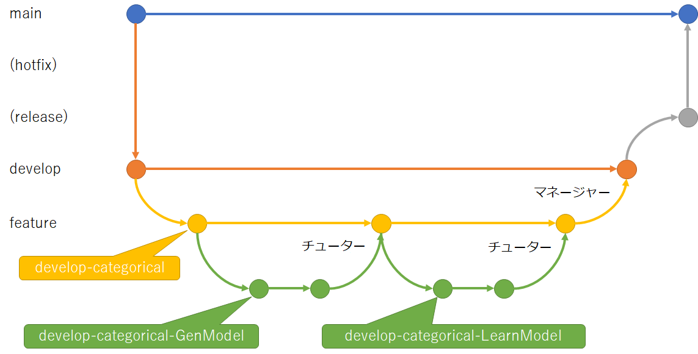
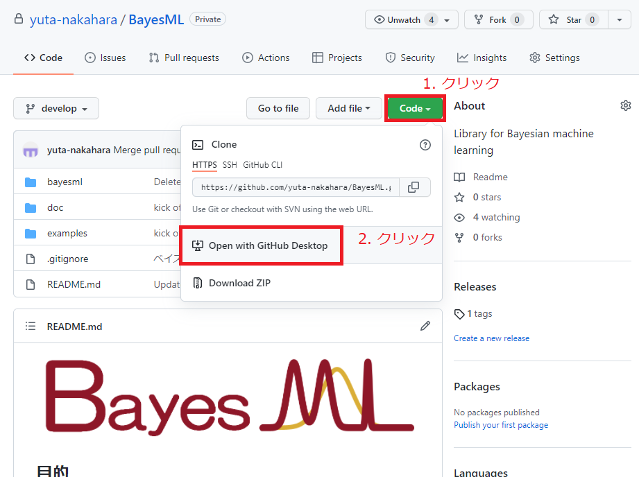
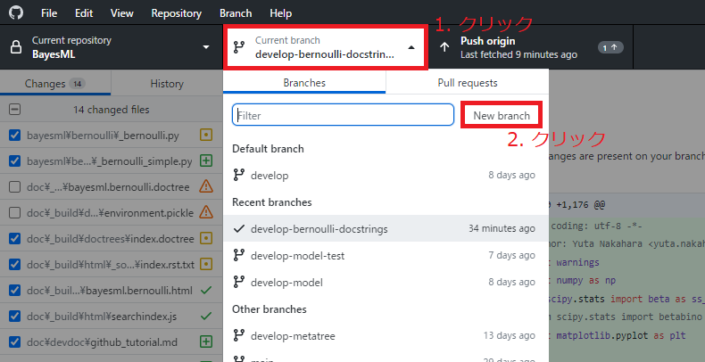
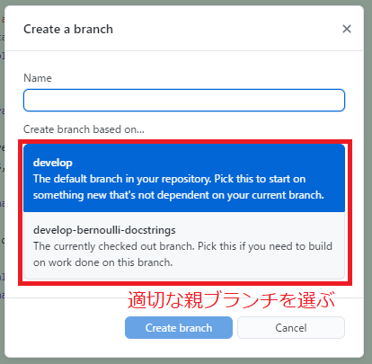
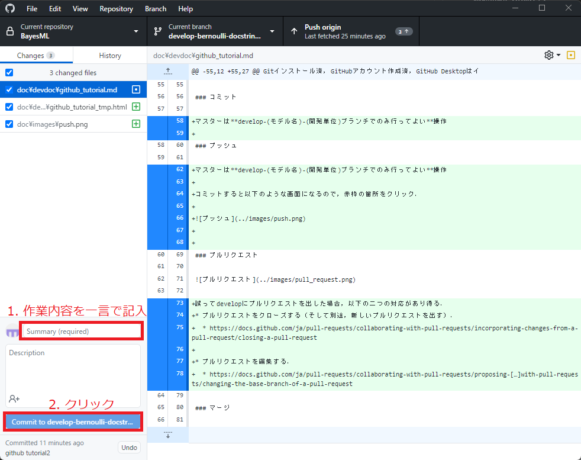
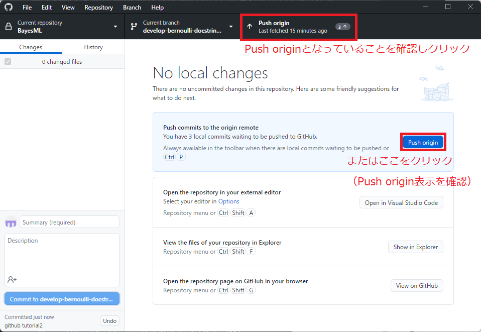
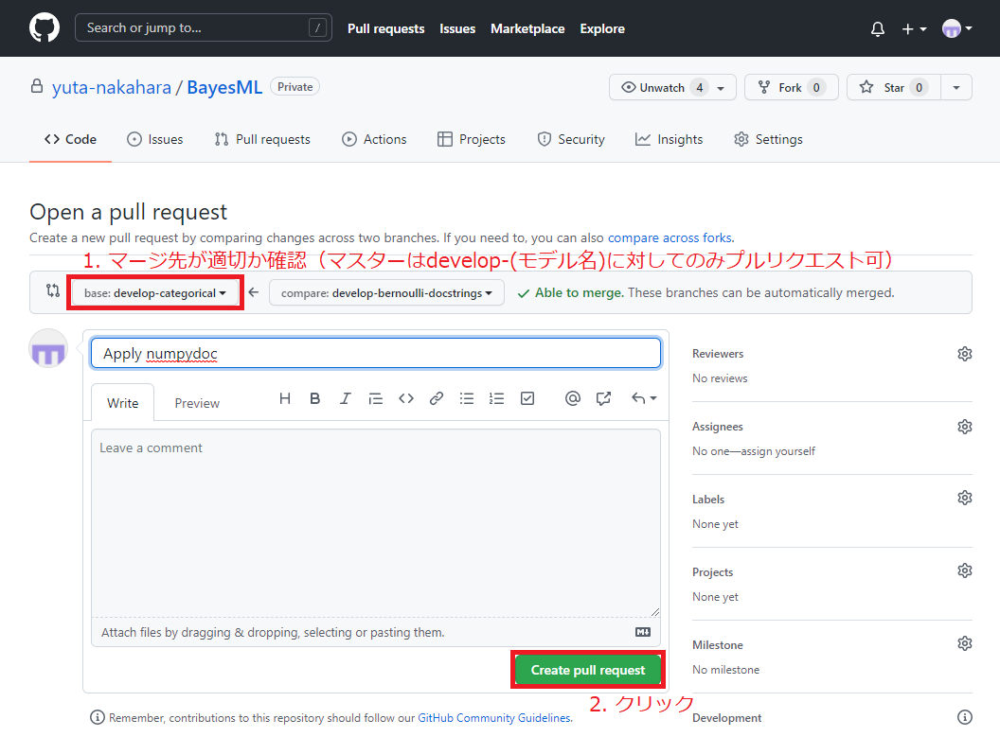
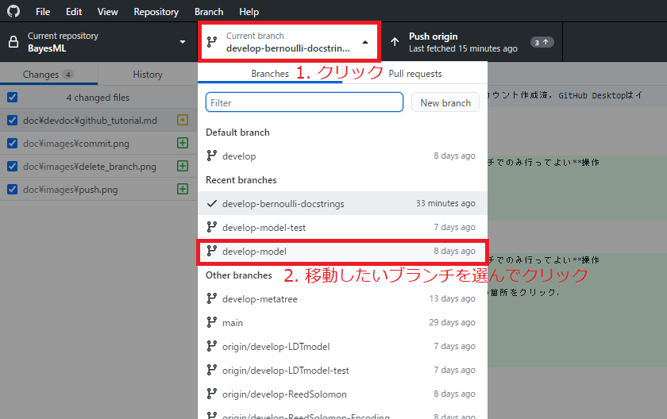
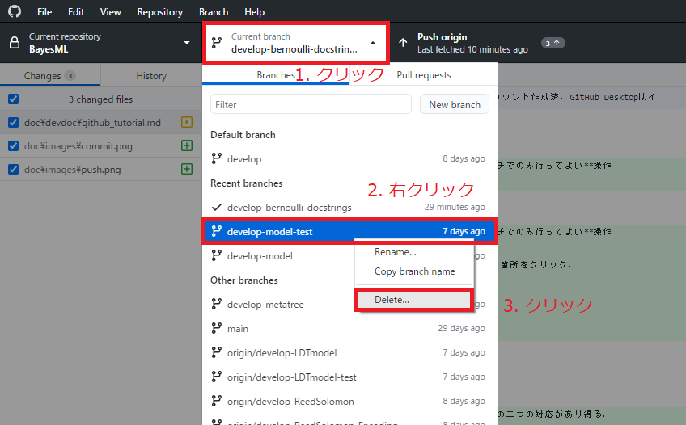

# GitHubの使い方

作成：中原

## 前提

Gitインストール済，GitHubアカウント作成済，GitHub Desktopはインストール済とする．

## 原則

慣れてきたら以下を意識するだけで良くなるはず．

* モデル開発者
  * コミット，プッシュして良いのはdevelop-(モデル名)-(開発単位)ブランチのみ．
  * プルリクエストを出していいのはdevelop-(モデル名)に対してのみ．
* チューター（一條，島田）
  * 担当マスターのdevelop-(モデル名)へのプルリクエストをチェック，マージ．
  * 一つのモデルの開発が終わったらdevelopに対してプルリクエストを出す．
* マネージャー（中原，飯窪）
  * developに対するプルリクエストをチェック，マージ．

## 運用方法

* 運用方法
  * 基本は「A succesful Git branching model」
    * http://nvie.com/posts/a-successful-git-branching-model/
    * https://backlog.com/ja/git-tutorial/stepup/05/
  * BayesMLのブランチ規則
    1. developブランチからdevelop-(モデル名)ブランチを作成
    2. develop-(モデル名)ブランチからdevelop-(モデル名)-(クラス名)ブランチを作成
    3. 以下を繰り返す
       1. develop-(モデル名)-(開発単位)ブランチをローカルで編集
       2. develop-(モデル名)-(開発単位)ブランチからdevelop-(開発単位)ブランチへプルリクエストを出す
       3. チューターがチェックしてマージ，不要なブランチを削除．
    4. develop-(モデル名)ブランチからdevelopブランチへプルリクエストを出す
    5. マネージャーがチェックしてマージ
  * 

## 操作方法

### リポジトリのクローン（1回やればよい）

画像の順にクリックする．

### ブランチの作成

### コミット

モデル開発者は**develop-(モデル名)-(開発単位)ブランチでのみ行ってよい**操作

### プッシュ

モデル開発者は**develop-(モデル名)-(開発単位)ブランチでのみ行ってよい**操作

コミットすると以下のような画面になるので，赤枠の箇所をクリック．

### プルリクエスト

誤ってdevelopにプルリクエストを出した場合，以下の二つの対応があり得る．
* プルリクエストを[クローズ](https://docs.github.com/ja/pull-requests/collaborating-with-pull-requests/incorporating-changes-from-a-pull-request/closing-a-pull-request)する（そして別途，新しいプルリクエストを出す）．
* プルリクエストを[編集](https://docs.github.com/ja/pull-requests/collaborating-with-pull-requests/proposing-changes-to-your-work-with-pull-requests/changing-the-base-branch-of-a-pull-request)する．

### マージ

チューターにのみ個別に教えます．
必ず**マージ先が適切かチェック**してからマージすること．

### ブランチの削除

削除したいブランチから他のブランチへ移動する．（現在のブランチに未保存の変更がある場合はstashなどを使う．[こちら](https://backlog.com/ja/git-tutorial/stepup/03/)を参照）

ブランチを削除する．

（GitHub上のブランチはドクターがマージと同時に削除する．）

### Gitインストール

（Windowsの場合）
以下のリンクの右側にあるDownload for Windowsをクリックしてインストーラをダウンロードする．

> http://git-scm.com/

とくにデフォルトから変える必要はないので，どんどん「次へ」を押してインストールする．

（Macの場合）
Macの場合はインストーラでダウンロードする形式ではない．
簡単なのはXcodeをApp storeからインストールすること．Gitも同時にインストールされる（ただ，Xcodeはかなり重いので，時間のあるときにやる）．
homebrewなどを使える人はそれで入れる．

（Windows/Mac共通）
インストールが終わったら，以下をのWebサイトのお使いのパソコン環境を選んでくださいのところを

> コンソールを選択

にして，初期設定を行ってください．

> https://backlog.com/ja/git-tutorial/intro/05/  
> https://backlog.com/ja/git-tutorial/intro/06/

### GitHubアカウント作成

以下からサインアップする．
画面の指示に従えば特に問題なく作成できるはず．

> https://github.co.jp/

心配ならちょっと検索して以下のようなサイトを参考にする．
> https://qiita.com/ayatokura/items/9eabb7ae20752e6dc79d

アカウントが作成できた人はBayesMLのリポジトリに登録するので，アカウント名を中原に伝える．

### GitHub Desktopインストール

以下から画面の指示に従えば問題なくインストールできるはず．

> https://desktop.github.com/
